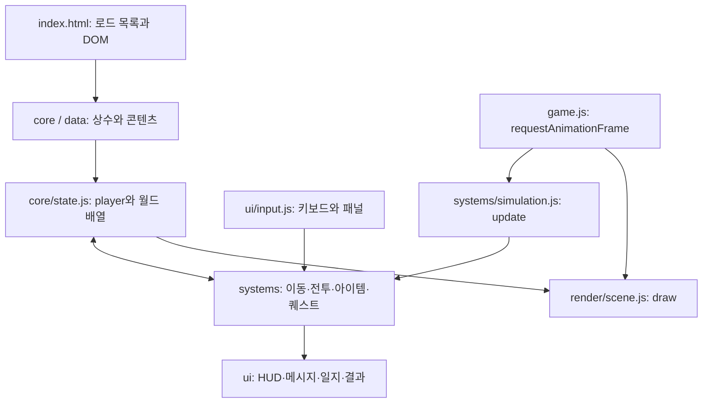

# 자연의 수호자

Canvas 2D와 순수 JavaScript로 만든 키보드 기반 싱글 플레이 브라우저 RPG입니다.
숲에서 전투와 퀘스트를 진행하고, 사막으로 이동해 파라오를 토벌하는 게임입니다.
서버·프레임워크·번들러 없이 실행하며, 개발 도구만 Node.js를 사용합니다.

## 실행

**온라인 플레이:** [GitHub Pages에서 게임 시작](https://obmaz.github.io/sjrpg/)

`index.html`을 브라우저에서 열거나, 저장소 루트에서 로컬 서버를 실행합니다.
`index.html` 단독 파일만으로는 실행되지 않으며 `src/`, `style.css`, `playful-pixels.mp3`가 함께 필요합니다.

```sh
python -m http.server 8765 --bind 127.0.0.1
```

브라우저에서 `http://127.0.0.1:8765`를 열고 **게임 시작**을 누릅니다.
데스크톱 키보드를 기준으로 구현되어 있습니다. 효과음은 Web Audio API로 합성하며, 배경음악은 저장소의 `playful-pixels.mp3`를 재생합니다.
외부 이미지·음원 다운로드는 필요하지 않습니다. 다시 도전은 페이지를 새로고침합니다.

### 모바일 주소창 대응 (App Height Lock)

터치 중심 기기(`pointer: coarse`)에서는 페이지 진입 시 `window.innerHeight`를 한 번 읽어
`--app-height`에 픽셀 값으로 저장합니다. 최상위 레이아웃, 게임 영역, 상점·도감의 높이가
이 값을 사용하므로 주소창이 숨겨지거나 나타나도 높이를 다시 계산하지 않습니다.
게임 영역은 기존 1.5배 확대를 반영해 고정 높이의 1/1.5을 사용합니다.
가로 폭은 계속 화면에 맞추며 데스크톱에서는 기존 창 크기 변경 동작을 유지합니다.
고정은 현재 페이지가 열린 동안 유지됩니다. 화면 회전 후에도 최초 높이를 유지하므로
새 방향의 높이에 맞추려면 페이지를 새로고침해야 합니다. 모바일 터치 조작은 별도 미구현입니다.
높이 변경·회전·재진입의 고정 규칙은 회귀 테스트로 확인했으며 실제 모바일 주소창 동작은 기기 검증이 필요합니다.

### GitHub Pages 배포

`main`에 푸시하면 GitHub Actions가 의존성을 설치하고 `npm run check`를 실행합니다.
검사를 통과한 커밋의 실행 파일만 Pages에 배포합니다. PR에서는 검사만 실행합니다.
Actions의 **Check and deploy** 워크플로를 수동 실행해 다시 배포할 수도 있습니다.

배포 파일은 `index.html`, `style.css`, `playful-pixels.mp3`, `src/`이며,
개발 도구·테스트·`node_modules`는 배포 파일에 포함하지 않습니다.
모든 리소스는 상대 경로를 사용하므로 `/sjrpg/` 경로에서도 실행됩니다.
저장소 Settings → Pages의 Source는 **GitHub Actions**입니다.

## 조작

| 키             | 동작                                                |
| -------------- | --------------------------------------------------- |
| WASD / 방향키  | 이동                                                |
| Space / J      | 주무기 공격, 누르고 있으면 재사용 대기시간마다 공격 |
| N / K          | 선택한 보조무기 사용                                |
| Q              | 보조무기 순환                                       |
| E              | 근처 NPC·포탈 상호작용, 대화·상점 닫기              |
| I / Esc        | 열린 패널 닫기, 패널이 없으면 인벤토리 열기         |
| 방향키 / Enter | 인벤토리 선택 이동 / 무기 장착                      |
| 1 / 2 / 3      | 소비 아이템 사용                                    |
| U              | 탈것에서 내리기                                     |
| C              | 도감 열기·닫기                                      |

무기 장착은 인벤토리 슬롯 클릭으로도 가능합니다. 탈것은 가까이 가면 자동 탑승합니다.
인벤토리·대화·상점·외관·도감·슬롯머신이 열리면 게임 시간이 멈춥니다.
슬롯머신은 결과 연출이 끝날 때 자동으로 닫히며 중간에 다른 패널을 열 수 없습니다.

## 현재 구현된 기능

| 영역     | 구현 범위                                                                                 |
| -------- | ----------------------------------------------------------------------------------------- |
| 월드     | 80×60 타일, 타일 크기 32px, 노이즈 기반 숲·사막 생성, 중앙 광장·오아시스, 카메라·미니맵   |
| 전투     | 주무기 16종, 근접·부채꼴·원거리·화염·밀치기·강타·콤보, 사용 횟수 제한, 넉백·빙결·방패     |
| 적       | 숲 정의 10종, 사막 정의 8종, 별도 대형 보스 6종; 도감에서 이름 기준 총 24종               |
| AI       | 배회·추적·근접·원거리·피격 경직, 비행, 보스의 지형 파괴·부하 소환                         |
| 성장     | 5마리 처치마다 Stage 상승, 추가 적 생성, 체력 전체 회복, 적 능력치 단계 보정              |
| 아이템   | 무기 인벤토리 12칸, 소비 아이템 3칸, 소비 아이템 정의 5종, 골드·무기 드롭, 상자·함정·미믹 |
| 보조무기 | 정의와 사용 로직 10종; 현재 퀘스트 보상으로 획득 가능한 종류는 5종                        |
| 퀘스트   | 정의 10개, 최대 3개 동시 수락, 단계·지역별 수락 조건, 목표 달성 시 자동 보상              |
| NPC·패널 | 마을 상점·암시장·사막 상점, 외관 변경, 퀘스트 대화·일지, 발견 기록 도감, 슬롯머신         |
| 탈것     | 자전거·말·오토바이·배, 전체 몸체 이동 판정, 배의 수상 이동 및 인근 육지 하차              |
| 결과     | 제한 시간 10분, 사망·시간 초과·사막 퀘스트 완료 결과 화면, 점수 기반 등급                 |
| 연출     | Canvas 지형·캐릭터·파티클·투사체·피해 텍스트, 합성 효과음·MP3 배경음악                    |

### 진행과 판정 규칙

- Stage는 누적 처치 수로 계산합니다. 별도의 경험치 레벨업 시스템은 없습니다.
- 처치·보스 퀘스트는 수락 전의 누적 기록도 반영합니다. 골드 목표는 현재 보유 금액을 사용합니다.
- 숲 주요 퀘스트 3개 완료는 숲 완료 안내이며, 게임을 종료하지 않습니다.
- 숲에서 보스 처치 후 1,000골드를 보유하면 중앙 포탈이 생성됩니다.
  `보스 토벌`과 `황금 제국` 퀘스트를 완료하면 사막 여행자도 등장합니다.
- 사막 이동은 편도입니다. 이동 전 달성된 퀘스트는 보상을 받고,
  미완료 숲 전용 퀘스트는 포기해 슬롯을 비웁니다. 지역 공통 퀘스트·완료 기록·보유 장비는 유지합니다.
- 사막에서 `황금 제국`과 `파라오 토벌`을 완료하면 최종 승리합니다.
- 분수 주변에서는 1초마다 최대 3 HP를 회복하고 같은 양의 골드를 소비합니다.
- 죽은 적에 대한 중복 피해로 보상을 반복 지급하지 않습니다.
  인벤토리가 가득 찼을 때 적의 무기 드롭은 발밑에 남습니다. 지상 무기는 120초 뒤 사라집니다.
- 슬롯머신은 50골드를 소비합니다. 전설의 검 당첨 시 인벤토리가 가득 차면 100골드로 대체합니다.
- 게임 시간은 시뮬레이션 시간입니다. 프레임 간격은 최대 0.1초로 제한하며,
  패널 일시정지나 백그라운드 탭으로 누락된 실제 시간을 한꺼번에 따라잡지 않습니다.

## 아직 구현되지 않았거나 연결이 필요한 부분

- **세이브·불러오기**: 상태는 메모리에만 있습니다. 새로고침하면 장비·퀘스트·도감 기록도 초기화됩니다.
- **보조무기 획득 경로**: 얼음 폭탄, 벼락, 독 안개, 대회복약, 도발 북은 데이터와 사용 로직은 있지만
  현재 퀘스트·상점·드롭에 획득 경로가 연결되지 않았습니다.
- **정교한 길찾기**: 적은 목표 방향 이동과 축별 충돌을 사용합니다. A*나 장애물 우회 경로 탐색은 없습니다.
  맵 연결 검사는 타일 단위이며 모든 몸체 크기에 대한 경로 접근성 보장은 없습니다.
- **모바일 조작·접근성**: 터치 조작, 게임패드, Canvas 내용의 스크린리더 설명은 없습니다.
- **설정 메뉴**: 키 재설정·음량·난이도 설정은 없습니다.
- **멀티플레이·백엔드**: 계정, 서버 저장, 온라인 순위, 협동 플레이는 없습니다.
- **모듈 격리**: 기능별 파일은 분리했지만 ES Modules나 의존성 주입으로 격리된 구조는 아닙니다.
- **전체 플레이 검증**: 자동 회귀 검사는 있으나 모든 시드·아이템 조합의 밸런스,
  모든 브라우저의 화면·사운드와 실제 플레이를 통한 최종 클리어는 검증하지 않았습니다.

## 프로젝트 구조

```text
.
├── index.html                 # DOM 패널과 브라우저 스크립트 로드 목록
├── style.css                  # HUD·패널·시작/결과 화면 스타일
├── playful-pixels.mp3         # 배경음악
├── src/
│   ├── core/                  # 상수·상태·충돌·노이즈·Canvas·카메라·모바일 높이 고정
│   ├── data/                  # 콘텐츠 정의와 거리별 적 선택 규칙
│   ├── systems/
│   │   ├── simulation.js      # 프레임별 게임 업데이트 순서
│   │   ├── world.js           # 맵 생성·연결성·타일 조회
│   │   ├── spawning.js        # 적·보스·NPC·초기 배치
│   │   ├── player.js          # 이동·공격 입력·캐릭터 타이머
│   │   ├── combat.js          # 공격·피해·처치·단계 진행
│   │   ├── enemy-ai.js        # 적 상태 머신
│   │   ├── entities.js        # 드롭·상자·투사체·장판·효과의 생성/업데이트
│   │   ├── mounts.js          # 탈것 생성·하차
│   │   ├── consumables.js     # 소비 아이템 사용
│   │   ├── auxiliary-weapons.js # 보조무기 선택·사용
│   │   ├── quests.js          # 수락 가능 여부·진행·보상·클리어 판정
│   │   ├── travel.js          # 포탈·편도 지역 이동
│   │   └── audio.js           # Web Audio 효과음·MP3 재생
│   ├── ui/                    # 키보드, 인벤토리·상점·대화·도감·HUD·일지·메시지
│   ├── render/                # Canvas 지형·엔티티·효과·미니맵·시작 화면
│   └── game.js                # DOM 이벤트 초기화·게임 시작·프레임 루프
├── scripts/
│   ├── page-sources.cjs       # HTML에서 소스 목록/ID를 읽는 공통 로더
│   └── check.cjs              # 소스 누락·문법·HTML 참조·ESLint 검사
├── tests/
│   ├── game.test.cjs          # 실제 게임 코드를 실행하는 회귀 테스트
│   └── helpers/game-harness.cjs # DOM·Canvas·타이머를 대체하는 VM 환경
├── .github/skills/            # 콘텐츠 추가·디버깅 작업 지침
└── .github/workflows/check.yml # push/PR 검사·main의 GitHub Pages 배포
```

## 아키텍처

일반 `<script>`를 순서대로 로드하는 구조입니다. 런타임 의존성은 브라우저 API뿐입니다.
`index.html`이 로드 순서의 기준이고, 상수·데이터·공통 상태를 준비한 뒤 기능 정의를 로드하고
마지막 `src/game.js`에서 DOM 초기화와 시작 버튼을 연결합니다.
함수 본문에서 뒤에 정의된 함수를 참조할 수 있지만, 로드 즉시 실행되는 코드는 순서에 영향을 받습니다.



`player`, `inventory`, 월드 엔티티 배열은 공유 상태입니다. 시스템은 이 상태를 변경하고,
렌더러는 현재 상태를 Canvas에 그립니다. 패널은 DOM으로 표시합니다.
`update()`는 화면 그리기와 분리돼 테스트에서 독립 실행할 수 있습니다.
`gameLoop()`가 시간 계산, 업데이트, 화면 그리기를 담당하며 종료·일시정지 상태도 그릴 수 있습니다.
현재 시스템에서 HUD·메시지 함수를 직접 호출하므로 UI와의 의존성까지 완전히 분리되지는 않았습니다.

업데이트는 플레이어 → 게임 시간 기반 지연 동작 → 적 → 투사체 → 장판·드롭·상자 → 효과·카메라 →
회복·시간 제한·상태 이상 → 퀘스트·포탈 순으로 진행합니다.
적의 공격·투사체·함정 상자로 치명적인 피해를 받으면 종료 판정을 우선해 같은 프레임의 후속 회복으로 되살아나지 않게 합니다.

게임 행동은 `canAct()`로 시작·종료·일시정지·인벤토리·생존 상태를 검사합니다.
월드 초기화는 `clearWorldEntities()`와 `WORLD_ENTITY_LISTS`를 사용합니다.
부메랑 같은 게임 지연 행동은 `deferGameAction()`으로 예약하여 일시정지 때 멈추고 지역 이동 때 취소합니다.
메시지 제거·슬롯 연출은 브라우저 타이머를 사용합니다. 배경음악은 HTML audio 요소로 재생합니다.

적·상자·NPC·탈것 생성은 전체 몸체가 들어갈 수 있는 위치를 검사합니다.
적 투사체와 플레이어 투사체는 이동 구간에서 가장 먼저 만나는 벽 또는 대상을 판정해
빠른 투사체가 작은 적을 지나치거나 벽 너머를 공격하지 않게 합니다.

## 개발과 검증

Node.js 24 이상이 필요합니다. 런타임 실행에는 npm 설치가 필요하지 않습니다.

```sh
npm ci
npm run check
```

| 명령                   | 용도                                                                          |
| ---------------------- | ----------------------------------------------------------------------------- |
| `npm run lint`         | HTML 소스 목록·ID 중복·누락, 문법, 정적 HTML ID 참조, 미정의/미사용 변수 검사 |
| `npm run format`       | Prettier 포맷 적용                                                            |
| `npm run format:check` | 포맷 확인                                                                     |
| `npm test`             | Node 내장 테스트 러너로 게임 회귀 검사                                        |
| `npm run check`        | lint → 포맷 확인 → 전체 테스트                                                |

정적 검사와 테스트는 `scripts/page-sources.cjs`를 통해 같은 HTML 소스 순서를 사용합니다.
브라우저 파일은 전역 참조를 검사하기 위해 로드 순서대로 합쳐 ESLint에 전달합니다.
파일을 추가하면 `index.html`에도 등록해야 하며, 등록 누락은 검사에서 실패합니다.
동적 HTML ID나 스크립트 초기화 순서의 모든 오류까지 정적 검사가 보장하지는 않습니다.

2026-10-06 리뷰 기준 회귀 테스트 52개가 통과했습니다.
전투·사망·일시정지·지역 이동·퀘스트 보상·드롭·탑승·투사체 충돌·스폰·도감·슬롯 결과를 검사합니다.
고정 시드 7개에서 마을 NPC와 상자의 전체 몸체 지형 판정도 확인합니다.
Edge에서 게임 시작, 인벤토리·도감 패널 전환과 화면 표시를 확인했습니다.
자동 테스트는 DOM·Canvas·오디오 환경을 대체하므로 픽셀 품질·사운드 품질을 검증하지 않습니다.

### 변경 시 지켜야 할 규칙

1. 폴더·파일은 소문자 kebab-case, 함수·변수는 camelCase, 클래스는 PascalCase,
   공유 상수는 UPPER_SNAKE_CASE를 사용합니다. Prettier 설정을 따릅니다.
2. 콘텐츠 정의는 템플릿입니다. 보유 장비·아이템은 복사해 사용하고 정의의 내구도를 직접 수정하지 않습니다.
3. 새 콘텐츠의 ID, 드롭 풀, 상점, 퀘스트 보상 참조가 실제 정의로 연결되는지 검사합니다.
4. 새로운 게임 동작은 해당 시스템에 추가하고, HUD·일지·메시지 표시는 `ui/`, 그리기는 `render/`에 둡니다.
5. 새 월드 상태 배열은 `WORLD_ENTITY_LISTS`에 등록해 지역 이동 때 이전 상태가 남지 않게 합니다.
6. 로직 수정은 재현 테스트를 추가한 뒤 `npm run check`와 관련 브라우저 조작으로 확인합니다.

## 이번 리뷰에서 수정한 부분

- 기존 단일 게임 파일을 `core/data/systems/ui/render`로 분리한 작업을 정리하고 검증했습니다.
- 시스템에 섞인 메시지·퀘스트 일지, 보조무기에 섞인 소비 아이템·탈것 코드를 책임별로 이동했습니다.
- 게임 시작·프레임 루프에서 시뮬레이션을 분리하고 소스 로더를 검사·테스트가 공유하게 했습니다.
- 장애물·물에 걸쳐 생성되던 상자·NPC의 전체 몸체 배치를 수정했습니다.
- 사막 Stage 상승 때 숲 퀘스트 NPC가 생성되던 조건을 수정했습니다.
- 도감 적 총계에서 별도 대형 보스가 빠지던 집계를 수정했습니다.
- 독의 남은 시간 이후에 피해가 발생하던 경계를 수정하고 사망 상태에서 아이템·공격을 차단했습니다.
- 슬롯머신에서 전설 무기가 골드로 대체되었는데 무기 획득으로 안내하던 문구를 수정했습니다.
