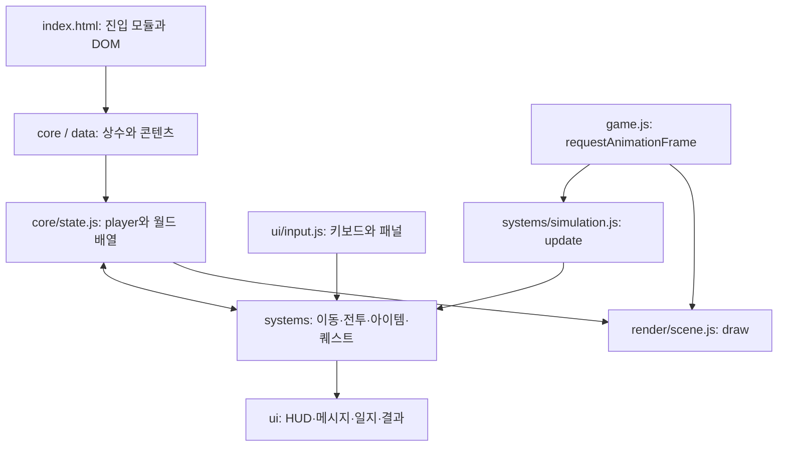

# 개발 참고

후속 AI 개발을 위한 현재 구조와 동작 계약입니다. 작업 지침은 [AGENTS.md](../AGENTS.md)를 먼저 읽고, 문서의 설명은 실제 코드와 대조합니다.
리뷰 이력이나 완료 기록 대신 현재 구현을 기술합니다.

## 프로젝트 구조

```text
.
├── index.html                 # DOM 패널·진입 모듈·초기 높이 고정 스크립트
├── style.css                  # HUD·패널·시작/결과 화면 스타일
├── playful-pixels.mp3         # 배경음악
├── AGENTS.md                  # AI 개발 지침과 참고 문서 진입점
├── docs/development.md        # 현재 구조·동작 계약·검증·배포
├── src/
│   ├── core/                  # 상수·상태·충돌·노이즈·Canvas·카메라·모바일 높이 고정
│   ├── data/                  # 콘텐츠 정의와 거리별 적 선택 규칙
│   ├── systems/
│   │   ├── simulation.js      # 프레임별 게임 업데이트 순서
│   │   ├── world.js           # 맵 생성·연결성·타일 조회
│   │   ├── spawning.js        # 적·보스·NPC·초기 배치
│   │   ├── player.js          # 이동·공격 입력·캐릭터 타이머
│   │   ├── combat.js          # 공격·피해·처치·단계 진행
│   │   ├── enemy-ai.js        # 적 상태 머신
│   │   ├── pathfinding.js     # 상태를 참조하지 않는 A* 탐색 엔진
│   │   ├── navigation.js      # 몸체·장애물 판정·경로 캐시·생성 위치 접근성
│   │   ├── entities.js        # 드롭·상자·투사체·장판·효과의 생성/업데이트
│   │   ├── mounts.js          # 탈것 생성·하차
│   │   ├── consumables.js     # 소비 아이템 사용
│   │   ├── auxiliary-weapons.js # 보조무기 선택·사용
│   │   ├── quests.js          # 수락 가능 여부·진행·보상·클리어 판정
│   │   ├── travel.js          # 포탈·편도 지역 이동
│   │   └── audio.js           # Web Audio 효과음·MP3 재생
│   ├── ui/                    # 키보드, 인벤토리·상점·대화·도감·HUD·일지·메시지
│   ├── render/                # Canvas 지형·엔티티·효과·미니맵·시작 화면
│   └── game.js                # DOM 이벤트 초기화·게임 시작·프레임 루프
├── scripts/
│   ├── page-sources.cjs       # HTML 진입점과 import/export 그래프 공통 로더
│   └── check.cjs              # 소스 누락·문법·HTML 참조·ESLint 검사
├── tests/
│   ├── game.test.cjs          # 실제 게임 코드를 실행하는 회귀 테스트
│   ├── navigation.test.cjs    # A*·몸체 접근성·보조무기 획득·모듈 격리 검사
│   ├── viewport.test.cjs      # 모바일 진입 높이 고정 검사
│   └── helpers/game-harness.cjs # DOM·Canvas·타이머를 대체하는 VM 환경
├── .github/skills/            # 콘텐츠 추가·디버깅 작업 지침
└── .github/workflows/check.yml # push/PR 검사·main의 GitHub Pages 배포
```

## 아키텍처

게임 코드는 ES Modules의 명시적 `import/export`로 연결됩니다. `index.html`에서는
초기 높이 고정 스크립트와 `type="module"`인 `src/game.js` 진입점만 로드합니다.
각 파일의 변수·함수는 모듈 범위에 있고 다른 파일에서는 필요한 공개 기능을 import합니다.
런타임 의존성은 브라우저 API뿐이며 번들링은 필요하지 않습니다.

변경 가능한 화면·진행 상태와 타일 맵은 `core/state.js`의 `session` 객체에 모았습니다.
플레이어·월드 배열도 해당 상태 모듈에서 export합니다. DOM 초기화는 모듈 로딩 완료 시점의
`document.readyState`를 확인하여 시작 버튼 이벤트를 연결합니다.



`player`, `inventory`, `session`, 월드 엔티티 배열은 import로 전달되는 공유 상태입니다. 시스템은 이 상태를 변경하고,
렌더러는 현재 상태를 Canvas에 그립니다. 패널은 DOM으로 표시합니다.
`update()`는 화면 그리기와 분리돼 테스트에서 독립 실행할 수 있습니다.
`gameLoop()`가 시간 계산, 업데이트, 화면 그리기를 담당하며 종료·일시정지 상태도 그릴 수 있습니다.
시스템이 HUD·메시지 함수를 명시적으로 import하며 일부 순환 의존성은 남아 있습니다.
따라서 이벤트 버스나 모든 시스템의 의존성 주입까지 도입한 구조는 아닙니다.
A* 엔진은 게임 상태에 의존하지 않으며 walkability·edge clearance·goal·heuristic을 함수로 전달받습니다.

업데이트는 플레이어 → 게임 시간 기반 지연 동작 → 적 → 투사체 → 장판·드롭·상자 → 효과·카메라 →
회복·시간 제한·상태 이상 → 퀘스트·포탈 순으로 진행합니다.
적의 공격·투사체·함정 상자로 치명적인 피해를 받으면 종료 판정을 우선해 같은 프레임의 후속 회복으로 되살아나지 않게 합니다.

게임 행동은 `canAct()`로 시작·종료·일시정지·인벤토리·생존 상태를 검사합니다.
월드 초기화는 `clearWorldEntities()`와 `WORLD_ENTITY_LISTS`를 사용합니다.
부메랑 같은 게임 지연 행동은 `deferGameAction()`으로 예약하여 일시정지 때 멈추고 지역 이동 때 취소합니다.
메시지 제거·슬롯 연출은 브라우저 타이머를 사용합니다. 배경음악은 HTML audio 요소로 재생합니다.

적·상자·NPC·탈것 생성은 전체 몸체가 들어갈 수 있는 위치를 검사합니다.
지상 적은 중앙 도착 지점에서 해당 몸체 크기로 도달 가능한 위치에만 생성합니다.
비행 적과 지형을 무시하는 거대 보스는 지상 경로 조건에서 제외합니다.

### 길찾기와 접근성

- 지상 적의 추적·배회·원거리 접근은 직선 경로가 막히면 A*의 4방향 격자 경로로 우회합니다.
- 노드에서는 몸체 전체의 지형·닫힌 상자 충돌을 확인하고, 연결 구간도 8px 이하 간격으로 검사합니다.
- 추적 목표는 플레이어가 있는 타일을 무조건 차지하는 것이 아니라 몸체 간 공격 거리까지 접근하는 것입니다.
- 경로는 최대 0.5초 재사용하며 목표 타일·맵 변경·다음 구간 막힘을 감지하면 다시 탐색합니다.
- 생성 위치 접근성은 몸체 크기·맵·지형 변경·상자 배치를 기준으로 캐시합니다.
- 지나갈 수 없는 좁은 통로는 몸체를 억지로 통과시키지 않습니다. 길이 없으면 정지하고 재탐색합니다.
- 움직이는 적과 플레이어는 실제 이동 충돌로 처리합니다. 여러 적의 통행 우선순위·군집 분산까지 구현하지는 않았습니다.

### 보조무기 구매

마을 상점에서 대회복약(120골드), 얼음 폭탄(150골드), 도발 북(120골드)을 판매합니다.
암시장과 사막 상점에서는 위 세 종류와 벼락(200골드), 독 안개(180골드)를 판매합니다.
구매 시 정의를 복사해 남은 횟수를 개별 관리하며 보조무기 목록에 추가하고 도감에 기록합니다.
처음 획득한 보조무기는 자동 선택됩니다. 소비 아이템 3칸·주무기 인벤토리 12칸과 별도로 보관합니다.

적 투사체와 플레이어 투사체는 이동 구간에서 가장 먼저 만나는 벽 또는 대상을 판정해
빠른 투사체가 작은 적을 지나치거나 벽 너머를 공격하지 않게 합니다.

## 모바일 높이 고정

터치 중심 기기(`pointer: coarse`)에서는 페이지 진입 시 `window.innerHeight`를 한 번 읽어
`--app-height`에 픽셀 값으로 저장합니다. 최상위 레이아웃, 게임 영역, 상점·도감의 높이가
이 값을 사용하므로 주소창이 숨겨지거나 나타나도 높이를 다시 계산하지 않습니다.
게임 영역은 기존 1.5배 확대를 반영해 고정 높이의 1/1.5을 사용합니다.
가로 폭은 계속 화면에 맞추며 데스크톱에서는 기존 창 크기 변경 동작을 유지합니다.
고정은 현재 페이지가 열린 동안 유지됩니다. 화면 회전 후에도 최초 높이를 유지하므로
새 방향의 높이에 맞추려면 페이지를 새로고침해야 합니다. 모바일 터치 조작은 별도 미구현입니다.
높이 변경·회전·재진입의 고정 규칙은 회귀 테스트로 확인했으며 실제 모바일 주소창 동작은 기기 검증이 필요합니다.

## 검증

Node.js 24 이상이 필요합니다. 런타임 실행에는 npm 설치가 필요하지 않습니다.

```sh
npm ci
npm run check
```

| 명령                   | 용도                                                                          |
| ---------------------- | ----------------------------------------------------------------------------- |
| `npm run lint`         | HTML 소스 목록·ID 중복·누락, 문법, 정적 HTML ID 참조, 미정의/미사용 변수 검사 |
| `npm run format`       | Prettier 포맷 적용                                                            |
| `npm run format:check` | 포맷 확인                                                                     |
| `npm test`             | Node 내장 테스트 러너로 게임 회귀 검사                                        |
| `npm run check`        | lint → 포맷 확인 → 전체 테스트                                                |

정적 검사와 테스트는 `scripts/page-sources.cjs`의 동일한 import 그래프를 사용합니다.
소스별로 ESLint를 실행하고 import 경로·named export·HTML ID·미정의 변수·import 대입을 검사합니다.
새 모듈은 사용하는 파일에서 import해야 하며, 진입점에서 도달하지 않는 소스는 검사에서 실패합니다.
회귀 테스트는 Node의 `vm.SourceTextModule`로 실제 모듈을 링크·실행합니다.
테스트 명령에 필요한 `--experimental-vm-modules` 옵션은 npm 스크립트에 포함돼 있습니다.
테스트 시나리오 접근자는 하네스에만 있으며 브라우저의 전역 공간에 게임 변수를 노출하지 않습니다.
동적 HTML ID와 모든 런타임 초기화 문제까지 정적 검사가 보장하지는 않습니다.

자동 테스트는 DOM·Canvas·오디오를 대체하므로 실제 화면·사운드 품질을 보장하지 않습니다.
기능 변경 시 관련 브라우저 동작을 확인하고, 확인하지 못한 범위는 완료 보고에 명시합니다.

## 배포

`main`에 푸시하면 GitHub Actions가 의존성을 설치하고 `npm run check`를 실행합니다.
검사를 통과한 커밋의 실행 파일만 Pages에 배포합니다. PR에서는 검사만 실행합니다.
Actions의 **Check and deploy** 워크플로를 수동 실행해 다시 배포할 수도 있습니다.

배포 파일은 `index.html`, `style.css`, `playful-pixels.mp3`, `src/`이며,
개발 도구·테스트·`node_modules`는 배포 파일에 포함하지 않습니다.
모든 리소스는 상대 경로를 사용하므로 `/sjrpg/` 경로에서도 실행됩니다.
저장소 Settings → Pages의 Source는 **GitHub Actions**입니다.
